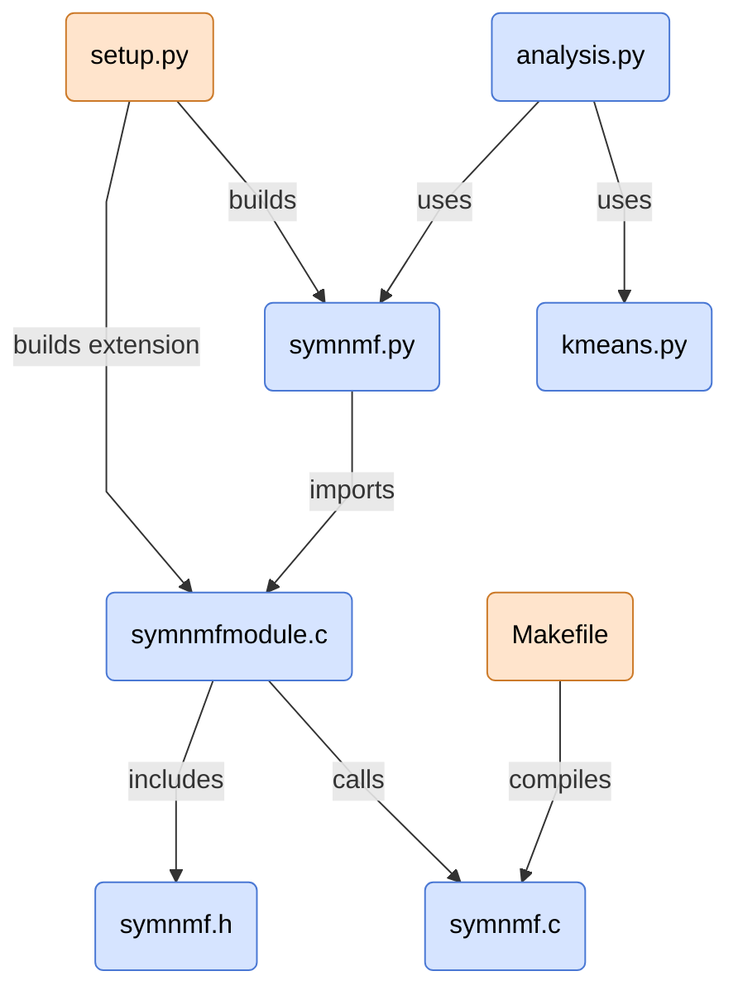

# final-project-code Folder

This is the implementation folder — all runnable source code for the project lives here.

## Contents
- `symnmf.c` — Core C implementation of SymNMF.  
- `symnmfmodule.c` — Python/C API bridge so SymNMF can be called from Python.  
- `symnmf.h` — Shared C header file with constants and function prototypes.  
- `symnmf.py` — Python wrapper and entry point for using SymNMF.  
- `kmeans.py` — Pure Python implementation of K-means (used in analysis).  
- `analysis.py` — Runs comparisons between SymNMF and K-means (e.g. silhouette scores).  
- `setup.py` — Build script for compiling the C extension (`symnmf_c_api`).  
- `Makefile` — Build script for the standalone C program (`symnmf`).  

---

## File Relations



---

## Usage

There are **three ways** to use the project:

### 1. C implementation of SymNMF

- **Step 1: Compile `symnmf.c` into the `symnmf` executable using the Makefile:**

```bash
make
```

*Note: The Makefile is configured for strict ISO C90 compilation, with all warnings and errors enabled:*

```bash
gcc -ansi -Wall -Wextra -Werror -pedantic-errors
```

- **Step 2: Run symnmf:** run
```bash
./symnmf [sym | ddg | norm] [points_file_name.txt]
```
### 2. Python implementation (using the C API)

- **Step 1: Build the Python C API module (required for `symnmf.py`):**
```bash
python3 setup.py build_ext --inplace
```

*Note: This compiles the C sources (symnmf.c, symnmfmodule.c) and makes them importable as symnmf_c_api inside Python.*

- **Step 2: Run `symnmf.py`:**

```bash
python3 symnmf.py [k] [symnmf | sym | ddg | norm] [points_file_name.txt]
```

### 3. python analysis implementation (using symnmd.py and kmeans.py)

- **Step 1: Build the Python C API module (required for `symnmf.py`):**

```bash
python3 setup.py build_ext --inplace
```

- **Step 2: Run `analysis.py`:**

```bash
python3 analysis.py [k] [points_file_name.txt]
```

