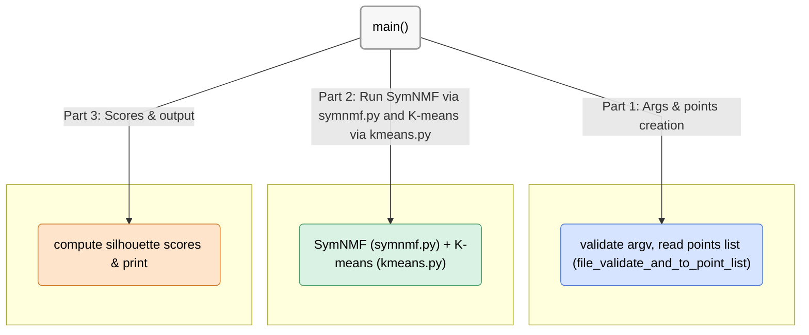

# analysis.py – SymNMF vs. K-means Comparison

This program runs both **SymNMF** (via `symnmf.py`) and **K-means** (via `kmeans.py`) on a dataset of points,  
and compares their clustering quality using the **silhouette score**.

***Note:** Before reading this guide, read the main repository `README.md` file.*

## Program Structure
**Execution starts in `main()` and follows three stages:**

**1. Input processing**  
- Reads command line arguments:  
  - `k` (number of clusters)  
  - `points_file` (CSV of points)  
- Validates arguments and loads points.

**2. Run clustering algorithms**  
- **SymNMF:** compute decomposition matrix `H`, convert to labels.  
- **K-means:** cluster points and extract labels.

**3. Output**  
- Compute silhouette scores for both methods.  
- Print results in the format:  
`nmf: <score>`  
`kmeans: <score>`


## Functions Graphic View



# Functions API

## Functions API

| <div align="center">Function Name</div> | Description | Args | Returns | Errors / Notes |
|---|---|---|---|---|
| <div align="center" style="background-color:#d6e4ff;">H_to_symnmf_label_list</div> | Convert decomposition matrix **H** (n×k) to a label list using argmax per row. | `decomp_mat: list[list[float]]` | `list[int]` of length `n` with cluster indices. | Assumes rectangular n×k input. Pure helper. |
| <div align="center" style="background-color:#d9f2e4;">clusters_to_kmeans_label_list</div> | Run K-means and convert cluster outputs to a label list. | `points: list[tuple[float,...]]` • `k: int` • `iterations: int=300` • `EPS: float=1e-4` | `list[int]` of length `n`. | Relies on `kmeans.k_means_clusters`. Pure helper. |
| <div align="center" style="background-color:#ffe4cc;">main</div> | CLI entry point: parse args, run SymNMF and K-means, compute silhouettes, print results. | Uses `sys.argv` (`k`, `points_file`) | `None` (prints scores) | Raises/handles `ValueError`, `OSError`, `MemoryError`. Exits with code `1` on error. |


# Usage

**Step 1: Build the Python C API module (required for `symnmf.py`):**
```bash
python3 setup.py build_ext --inplace
```

*Note: This compiles the C sources (symnmf.c, symnmfmodule.c) and makes them importable as symnmf_c_api inside Python.*

**Step 2: Run `analysis.py`:**

```bash
python analysis.py [k] [points_file_name.txt]
```


