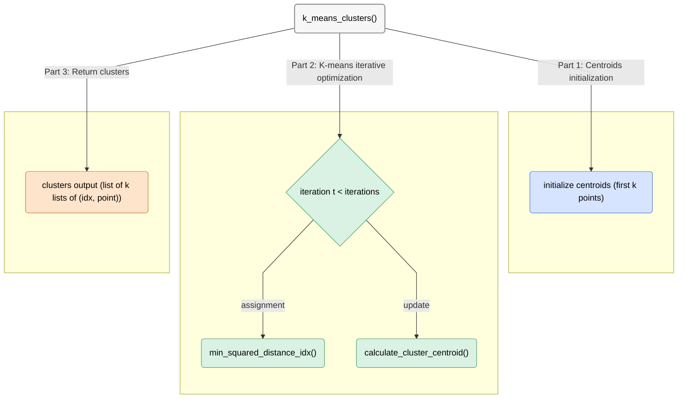

# K-means – Python implementation

This module clusters a CSV-sourced set of points into `k` groups using the standard K-means algorithm (L2 distance), with centroids initialized to the first `k` points.  
It also includes small helper functions for nearest-centroid search and centroid recomputation.

**In this project, `kmeans.py` is not the primary algorithm** (which was implemented in depth during HW1).  
Instead, it serves as a supporting module, imported and used by `analysis.py` to compare clustering quality against SymNMF.

***Note:** Before reading this guide, read the main repository `README.md` file.*

## Program Structure
**Execution starts in `k_means_clusters()` and is organized into three main stages:**  

**1. Arguments & input processing:**  
- **Expect:** `k (int)`, `iterations (int)`, `EPS (float)`, `dim (int)`, `points (list[tuple[float,...]])`.
- **Initialization:** The initial `k` centroids are set to the **first `k` points**.

**2. K-means iterative optimization:**  
For up to `iterations` rounds (or untill convergence):
- **Assignment step:** Each point is assigned to its nearest centroid (squared Euclidean distance) using  
  `min_squared_distance_idx(point, dim, k, centroids)`.
- **Update step:** For each cluster, recompute the centroid with  
  `calculate_cluster_centroid(cluster_points, dim, last_centroid)`.  
  If a cluster is empty, its centroid remains the previous one.
- **Convergence check:** Compute the Euclidean shift of each centroid.  
  If **all** centroid shifts are ≤ `EPS`, stop early.

**3. Output:**  
Return `clusters` as a list of length-`k` lists; each inner list contains tuples `(point_index, point_coordinates)`.  
Helper functions are pure and side-effect free.

## Functions Graphic view
***Note:** For best understanding, this diagram mirrors the runtime flow and helper calls.*



## Functions API

| <div align="center">Function Name</div> | Description | Args | Returns | Errors / Notes |
|---|---|---|---|---|
| <div align="center" style="background-color:#d9f2e4;">k_means_clusters</div> | Run K-means: initialize centroids, iteratively assign points and update centroids until all shifts ≤ `EPS` or `iterations` reached. | `k: int` • `iterations: int` • `EPS: float` • `dim: int` • `points: list[tuple[float,...]]` | `list[list[tuple[int, tuple[float,...]]]]`: `k` clusters; each item is `(point_idx, point_tuple)`. | Assumes `1 < k < n`, `iterations ≥ 1`, `dim ≥ 1`. Centroids initialized to first `k` points. Early stop on convergence. |
| <div align="center" style="background-color:#d9f2e4;">min_squared_distance_idx</div> | Return index of the nearest centroid by **squared Euclidean** distance. | `point: tuple[float,...]` • `dim: int` • `k: int` • `centroids: list[list[float]]` | `int`: index (0-based) of closest centroid. | Pure helper; no side effects. Uses a simple loop over `k` centroids. |
| <div align="center" style="background-color:#d9f2e4;">calculate_cluster_centroid</div> | Compute centroid (mean) of points in a cluster. If cluster is empty, return a copy of `last_centroid`. | `cluster: list[list[float]]` • `dim: int` • `last_centroid: list[float]` | `list[float]`: centroid coordinates of length `dim`. | Handles empty clusters gracefully by keeping previous centroid. Pure helper. |

## Usage

This module is **not** a standalone program.  
It is imported and used by `analysis.py` to provide K-means clustering results for comparison with SymNMF.

**How it is used:**

```python
# Example inside analysis.py:

from kmeans import k_means_clusters

clusters = k_means_clusters(k, iterations, EPS, dim, points)
```
