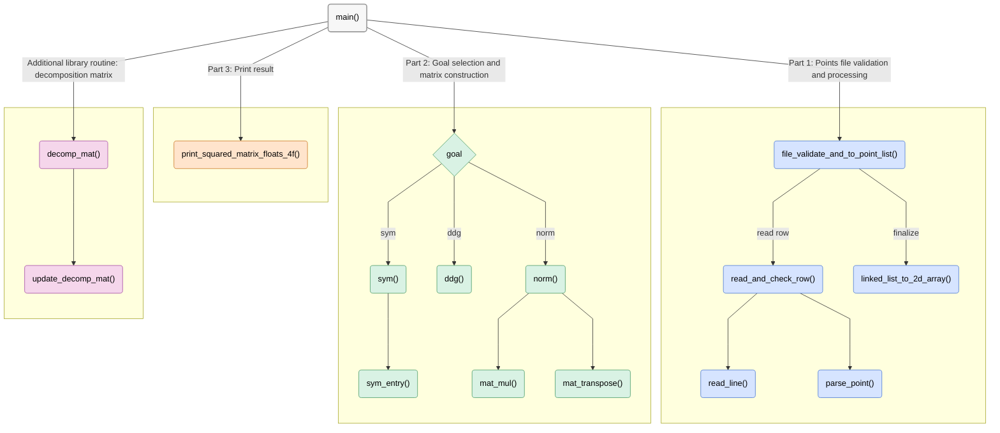

# SymNMF – C implementation

This program reads a CSV file of points, constructs the requested matrix (`sym`, `ddg`, or `norm`), and prints it.  
It also includes internal functions supporting the SymNMF decomposition algorithm.

***Note:** Before reading this guide, read the main repository `README.md` file.*

## Program Structure
**Execution starts in `main()` and is organized into three main stages:**  

**1. Points file validation and processing: build a validated point list.**  
The program reads the file row by row. The **first row** determines the dimension and initializes the list. Each subsequent row is parsed, validated against that dimension, and appended. Finally, the linked list is converted to a contiguous `n × dim` array.

**2. Goal selection and matrix construction:**  
Based on the `goal` argument (`sym`, `ddg`, or `norm`):  

- **sym:** Build the symmetric affinity matrix `A` where  

$$
A_{ij} = \exp\left(-\frac{\lVert p_i - p_j \rVert^2}{2}\right)
$$  

- **ddg:** First build `A`, then construct the diagonal degree matrix `D` with row sums of `A`:  

$$
D_{ii} = \sum_{j=1}^{n} A_{ij}
$$  

- **norm:** First build `A`, then `D`, and finally compute the normalized similarity matrix `W`:  

$$
W = D^{-1/2} \ A \ D^{-1/2}
$$  

**3. Output:**  
The chosen square matrix is printed with four decimal places, rows comma-separated.  

*Note:* Additional library routines (not called by `main`) implement iterative updates for SymNMF decomposition.

## Functions Graphic view
***Note:** For best understanding, this diagram mirrors the runtime flow and helper calls.*



## Functions API

| <div align="center">Function Name</div> | Description | Args | Returns | Errors / Notes |
|---|---|---|---|---|
| <div align="center" style="background-color:#d6e4ff;">file_validate_and_to_point_list</div> | Read CSV rows, validate consistent dimension, build a linked list of points, and set `n`/`dim`. | `in: FILE*` • `dim_out: int*` • `n_out: int*` • `point_lst_head: Node*` | `int`: `1` success, `0` empty file, `-1` error | On error frees list tail & head’s point. Caller later frees list. |
| <div align="center" style="background-color:#d6e4ff;">read_line</div> | Read one CSV line into a malloc’ed buffer (handles `\n`, `\r`, `\r\n`). | `in: FILE*` • `buff_out: char**` • `len_out: size_t*` | `int`: `1` success, `0` clean EOF, `-1` error | **static** helper. Caller frees `*buff_out`. |
| <div align="center" style="background-color:#d6e4ff;">parse_point</div> | Parse a CSV string buffer into doubles; on first row sets `*dim`, else enforces it. | `buff: char*` • `dim: int*` • `out_point: double**` | `int`: `1` success, `-1` error | **static** helper. Caller frees `*out_point`. |
| <div align="center" style="background-color:#d6e4ff;">read_and_check_row</div> | Read + parse a row into a validated point. | `in: FILE*` • `dim: int*` • `out_point: double**` | `int`: `1` success, `0` EOF, `-1` error | **static** wrapper over `read_line` + `parse_point`. |
| <div align="center" style="background-color:#d6e4ff;">free_tail_and_point</div> | Free head’s point and all nodes after it. | `head: Node*` | – | **static** helper. Safe on `NULL` fields. |
| <div align="center" style="background-color:#d6e4ff;">free_list</div> | Free linked list of nodes and their point arrays. | `head: Node*` | – | Safe on `NULL`. |
| <div align="center" style="background-color:#d6e4ff;">linked_list_to_2d_array</div> | Convert point list to contiguous `n×dim` array. | `head: Node*` • `n: int` • `dim: int` • `out_arr: double**` | `int`: `1` success, `-1` error | Caller frees `*out_arr`. |
| <div align="center" style="background-color:#d9f2e4;">sym</div> | Build symmetric affinity matrix `A`. | `dim: int` • `n: int` • `mat: const double*` • `out_A: double**` | `int`: `1` success, `-1` error | Uses helper `sym_entry`. Caller frees `*out_A`. |
| <div align="center" style="background-color:#d9f2e4;">sym_entry</div> | Compute entry `exp(-||p1-p2||² / 2)`. | `p1: const double*` • `p2: const double*` • `dim: int` | `double` | **static** helper. |
| <div align="center" style="background-color:#d9f2e4;">ddg</div> | Build diagonal degree matrix `D` from `A` (row sums on diagonal). | `n: int` • `A: const double*` • `out_D: double**` | `int`: `1` success, `-1` error | Caller frees `*out_D`. |
| <div align="center" style="background-color:#d9f2e4;">norm</div> | Compute `W = D^{-1/2} A D^{-1/2}`. | `n: int` • `A: const double*` • `D: const double*` • `out_W: double**` | `int`: `1` success, `-1` error | Uses `mat_mul`. Caller frees `*out_W`. |
| <div align="center" style="background-color:#ffe4cc;">decomp_mat</div> | Iteratively update decomposition matrix `H` from `H0` until `||H_{t+1}-H_t||_F^2 < EPS` or `MAX_ITERS`. | `n: int` • `k: int` • `W: const double*` • `H0: const double*` • `out: double**` | `int`: `1` success, `-1` error | Uses `EPS=1e-4`, `BETA=0.5`, `MAX_ITERS=300`. Caller frees `*out`. |
| <div align="center" style="background-color:#ffe4cc;">update_decomp_mat</div> | Single SymNMF update step. | `n: int` • `k: int` • `W: const double*` • `H: const double*` • `out_H: double**` | `int`: `1` success, `-1` error | **static**. Uses `mat_mul`, `mat_transpose`. Caller frees `*out_H`. |
| <div align="center" style="background-color:#ffe4cc;">mat_mul</div> | Multiply `A(rows×m)` by `B(m×cols)`. | `rows, m, cols: int` • `A: const double*` • `B: const double*` • `out: double**` | `int`: `1` success, `-1` error | **static**. Caller frees `*out`. |
| <div align="center" style="background-color:#ffe4cc;">mat_transpose</div> | Transpose a `rows×cols` matrix. | `rows, cols: int` • `mat: const double*` • `out: double**` | `int`: `1` success, `-1` error | **static**. Caller frees `*out`. |
| <div align="center" style="background-color:#f7f7f7;">print_squared_matrix_floats_4f</div> | Print an `n×n` matrix with 4 decimals, comma-separated. | `n: int` • `mat: const double*` | – | Prints to `stdout`. |
| <div align="center" style="background-color:#f7f7f7;">main</div> | Entry point: parse args, build matrix per `goal`, print result. | `argc: int` • `argv: char**` | `int`: `0` success (errors exit(1)) | Goals: `sym`, `ddg`, `norm`. |

## Usage

**Step 1: Compile `symnmf.c` into the `symnmf` executable using the Makefile:**

```bash
make
```

*Note: The Makefile is configured for strict ISO C90 compilation, with all warnings and errors enabled:*

```bash
gcc -ansi -Wall -Wextra -Werror -pedantic-errors
```

**Step 2: Run symnmf:** run
```bash
./symnmf [sym | ddg | norm] [points_file_name.txt]
```


