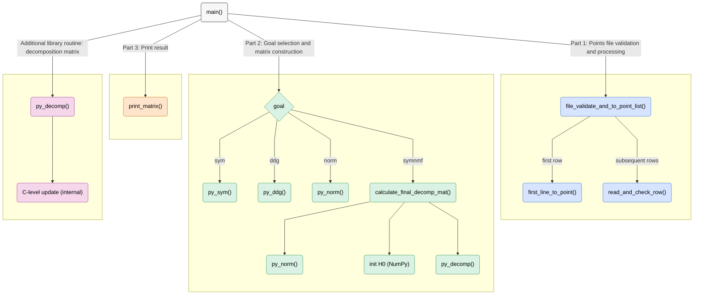

# SymNMF – Python implementation  
This program validates a CSV file of points, invokes the C-accelerated API (`py_sym`, `py_ddg`, `py_norm`, `py_decomp`) to build the requested matrix or compute the final SymNMF decomposition (`symnmf`), and prints it.  
It also seeds NumPy for reproducibility and includes helpers for input parsing and 4-decimal formatted output.  
***Note:** Before reading this guide, read the main repository `README.md` file.*  

## Program Structure
**Execution starts in `main()` and is organized into three main stages:**  

**1. Arguments & input validation and proccessing:**  
- Expect: `k (int)`, `goal (string)`, `path/to/points.txt`.
- **Validate k**: `1 < k < n`.  
- **Validate goal**: `goal ∈ {"symnmf","sym","ddg","norm"}`   
- **Points file validation and processing:** The program reads the file row by row. The first row determines the dimension and initializes the list. Each subsequent row is parsed, validated against that dimension, and appended to the points array.  

**3. Goal selection and matrix/decomposition construction:**  
Based on the `goal` argument (`sym`, `ddg`, `norm`, or `symnmf`) :  

- **sym:** Build the symmetric affinity matrix `A` where  

$$
A_{ij} = \exp\left(-\frac{\lVert p_i - p_j \rVert^2}{2}\right)
$$  

- **ddg:** First build `A`, then construct the diagonal degree matrix `D` with row sums of `A`:  

$$
D_{ii} = \sum_{j=1}^{n} A_{ij}
$$  

- **norm:** First build `A`, then `D`, and finally compute the normalized similarity matrix `W`:  

$$
W = D^{-1/2} \ A \ D^{-1/2}
$$  

- **symnmf:** Build `W`, initialize a non-negative random matrix `H0`, then iteratively update with the SymNMF decomposition routine until convergence.  

***Note:** All heavy matrix calculations are executed by the **C implementation** (`symnmf.c`), accessed through the **Python C API module** (`symnmfmodule.c`). Python here mainly validates inputs, manages data as lists/NumPy arrays, and prints results.*

**4. Output:**  
The chosen matrix (or final decomposition `H`) is printed with four decimal places, rows comma-separated.  

***Note:** NumPy is seeded for reproducibility, and the decomposition uses the C-accelerated `py_decomp` routine.*


## Functions Graphic view
***Note:** For best understanding, this diagram mirrors the runtime flow and helper calls.*



## Functions API

| <div align="center">Function Name</div> | Description | Args | Returns | Errors / Notes |
|---|---|---|---|---|
| <div align="center" style="background-color:#d6e4ff;">file_validate_and_to_point_list</div> | Validate file and build a list of points. Reads first row to set dim, then enforces it for all rows. | `f: IO[str]` | `list[tuple[float,...]]` | Raises `ValueError` on any invalid input / format. |
| <div align="center" style="background-color:#d6e4ff;">first_line_to_point</div> | Read the first non-empty row, validate, and return `(dim, point)`. | `f: IO[str]` | `tuple[int, tuple[float,...]] \| None` | Returns `None` on empty line; raises `ValueError` on invalid format. |
| <div align="center" style="background-color:#d6e4ff;">read_and_check_row</div> | Read one row, enforce expected dimension (if provided), and parse as floats. | `f: IO[str]` • `dim: int \| None` | `tuple[float,...] \| None` | Returns `None` on EOF; raises `ValueError` on missing newline, spaces, empty fields, non-floats, or wrong length. |
| <div align="center" style="background-color:#ffe4cc;">calculate_final_decomp_mat</div> | Compute final SymNMF `H`: build `W` (`py_norm`), init non-negative `H0` (NumPy, seeded), update via `py_decomp`. | `points: list[tuple[float]]` • `k: int` | `list[list[float]]` | Uses C-Py API: `symnmf.py_norm`, `symnmf.py_decomp`. |
| <div align="center" style="background-color:#f7f7f7;">print_matrix</div> | Print a 2D matrix with 4-decimal formatting, comma-separated rows. | `mat: list[list[float]]` | – | Prints to `stdout`. |
| <div align="center" style="background-color:#f7f7f7;">main</div> | CLI entry: parse `k`, `goal`, file path; build points; run selected goal (`sym`, `ddg`, `norm`, `symnmf`); print result. | – | – | On error prints `"An Error Has Occurred"` and `sys.exit(1)`. C-accelerated calls: `py_sym`, `py_ddg`, `py_norm`, `py_decomp`. |

## Usage

**Step 1: Build the Python C API module (required for `symnmf.py`):**
```bash
python3 setup.py build_ext --inplace
```

*Note: This compiles the C sources (symnmf.c, symnmfmodule.c) and makes them importable as symnmf_c_api inside Python.*

Step 2: Run `symnmf.py`:

```bash
python3 symnmf.py [k] [symnmf | sym | ddg | norm] [points_file_name.txt]
```


