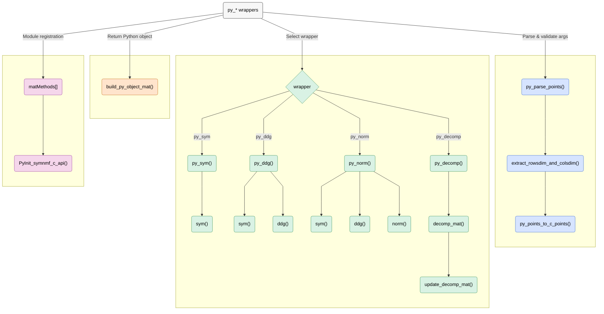

# SymNMF – Python C API module (`symnmfmodule.c`)

This module exposes C implementations to Python: it wraps the core routines (`sym`, `ddg`, `norm`, `decomp`) and returns Python list-of-lists results.  
It parses Python sequences into C matrices, calls the C algorithms from `symnmf.h`, and builds Python objects for the return values.

***Note:*** Before reading this guide, read the main repository `README.md` file.

## Program Structure
**Execution flows through Python wrappers and shared helpers:**

**1. Parse & validate Python arguments**  
Each wrapper (`py_sym`, `py_ddg`, `py_norm`, `py_decomp`) unpacks `args` and validates shapes/types.  
- `py_parse_points()` extracts the points object when applicable.  
- `extract_rowsdim_and_colsdim()` derives `n` and `dim`/`k`.

**2. Convert Python sequences → C matrices (contiguous)**  
`py_points_to_c_points()` allocates `double*` buffers and copies values row-by-row from Python to C (size checks enforced).

**3. Dispatch to core C algorithms (from `symnmf.h`)**  
- `py_sym`: calls `sym(dim, n, points, &sym_mat)`.  
- `py_ddg`: `sym(...)` → `ddg(n, sym_mat, &ddg_mat)`.  
- `py_norm`: `sym(...)` → `ddg(...)` → `norm(n, sym_mat, ddg_mat, &norm_mat)`.  
- `py_decomp`: converts `W (n×n)` and `H0 (n×k)` → `decomp_mat(n, k, W, H0, &H_new)`.

**Note: `py_decomp` back-and-forth routine**: 
Unlike the other wrappers, `py_decomp` is part of an iterative workflow:

1. Python side first calls `py_norm(points)` to obtain the normalized similarity matrix `W`.  
2. That `W` and an initial guess `H0` are passed into `py_decomp(W, H0)`.  
3. Inside C, `decomp_mat()` repeatedly updates `H` until convergence.  
4. The final improved `H` is converted back into a Python list-of-lists and returned.  

This creates a **cycle between Python and C**: Python orchestrates the high-level flow (`norm → decomp`), while C performs the heavy numerical updates.


**4. Build Python return values**  
`build_py_object_mat(n, k, mat, &py_mat)` creates a list-of-lists with floats and returns it to Python.

**5. Robust error handling & memory hygiene**  
On any failure, a Python exception is set, intermediate C buffers are freed, and the function returns `NULL`.  
`(void)self;` silences unused-parameter warnings under strict flags.

**6. Module table & init**  
`matMethods[]` maps Python names to wrappers; `PyInit_symnmf_c_api()` creates the module object.

## Functions Graphic view
***Note:** Python wrappers → shared helpers → core C → Python return.*


## Functions API

| <div align="center">Function Name</div> | Description | Args | Returns | Errors / Notes |
|---|---|---|---|---|
| <div align="center" style="background-color:#d9f2e4;">py_sym</div> | Python wrapper: build S = sym(points) and return as list-of-lists. | `self: PyObject*` • `args: PyObject* (tuple: points)` | `PyObject*` (n×n list of lists) on success; `NULL` on error | Sets exception on error; `(void)self` to silence unused. |
| <div align="center" style="background-color:#d9f2e4;">py_ddg</div> | Python wrapper: compute D = ddg(sym(points)) and return as list-of-lists. | `self: PyObject*` • `args: PyObject* (tuple: points)` | `PyObject*` (n×n list of lists) on success; `NULL` on error | Sets exception; frees intermediates. |
| <div align="center" style="background-color:#d9f2e4;">py_norm</div> | Python wrapper: compute N = norm(sym(points), ddg(sym(points))) and return as list-of-lists. | `self: PyObject*` • `args: PyObject* (tuple: points)` | `PyObject*` (n×n list of lists) on success; `NULL` on error | Sets exception; frees intermediates. |
| <div align="center" style="background-color:#d9f2e4;">py_decomp</div> | Python wrapper: update decomposition H from norm matrix and initial H0. | `self: PyObject*` • `args: PyObject* (tuple: norm_obj, decomp_obj)` | `PyObject*` (n×k list of lists) on success; `NULL` on error | Sets exception; validates dims; frees intermediates. |
| <div align="center" style="background-color:#d6e4ff;">py_parse_points</div> | Parse Python args into points object. | `args: PyObject*` • `out_points_obj: PyObject**` | `int`: `1` on success, `-1` on parse error | Sets Python exception on error. |
| <div align="center" style="background-color:#d6e4ff;">extract_rowsdim_and_colsdim</div> | Extract matrix dimensions from Python sequence of sequences (list/tuple). | `mat_obj: PyObject*` • `rows_dim: int*` • `cols_dim: int*` | `int`: `1` on success, `-1` on error | DECREFs temp row; sets exception on error. |
| <div align="center" style="background-color:#d6e4ff;">py_points_to_c_points</div> | Convert Python seq-of-seqs to C heap matrix \[n][dim_or_k]. | `mat_obj: PyObject*` • `n: int` • `dim_or_k: int` • `out_mat: double**` | `int`: `1` on success, `-1` on error | Allocates `double*`; caller frees `*out_mat`; sets exception. |
| <div align="center" style="background-color:#ffe4cc;">build_py_object_mat</div> | Build a Python list-of-lists from C matrix \[n][k]. | `n: int` • `k: int` • `mat: double*` • `py_mat_out: PyObject**` | `int`: `1` on success, `-1` on error | Allocates Python lists/floats; caller DECREFs `*py_mat_out`. |
| <div align="center" style="background-color:#f5d6eb;">matMethods</div> | Method table for symnmf_c_api. Maps Python names (py_sym, py_ddg, py_norm, py_decomp) to their C wrapper functions. | – | – | Array terminates with `{NULL, NULL, 0, NULL}`. |
| <div align="center" style="background-color:#f5d6eb;">PyInit_symnmf_c_api</div> | Module initialization for symnmf_c_api. | – | `PyObject*` module on success; `NULL` on failure | Creates module from `symnmfmodule`. |

## Usage

This module is **not executed directly**.  
It is compiled into a Python extension using the provided `setup.py`:

```bash
python3 setup.py build_ext --inplace
```

Running this command is necessary to build the extension and enable using the C library from Python.


