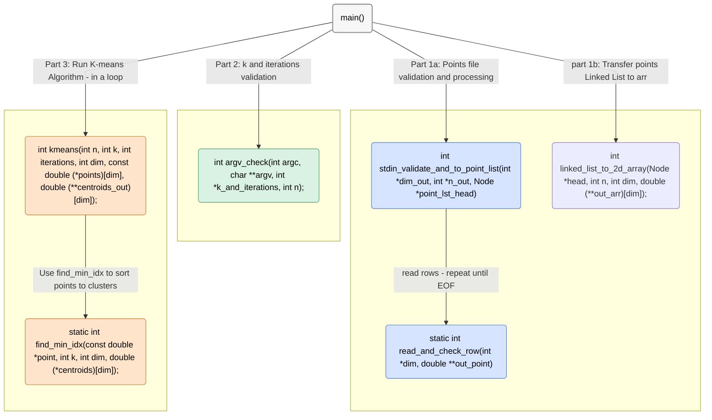

# K-means - C implementation

## This program implements the K-means clustering algorithm and outputs the final centroids of the computed clusters.

***Note:** Before reading this guide, read the main repository `RADME.md` file.*

## Program Structure
**The program begins execution in the main() function and is organized into three main stages:** 

**1. Points file validation and processing: Validate the points file. if valid, creates point list.**  
Since the points are provided through stdin, each row can only be read once. To handle this, the first row is processed separately—this initializes the list and determines the expected point dimension. The remaining rows are then read sequentially, ensuring each matches the expected dimension, and appended to the points list.

**2. `k` and `iterations` validation: Validate the `k` and `iterations` input and store them if valid.**  
*Note: The points list must be built before this step, as the number of points is required to validate k.*

**3. Run K-means Algorithm: Runs the K-means algorithm on the inputs and prints the final centroids list.**  
The algorithm runs for the specified number of iterations or stops earlier if the centroids remain unchanged between iterations.  
Once completed, the final centroids are rounded to four decimal places for alignment and then printed.

## Functions Graphic view
***Note:** For best understanding, i recommend to look at the Graph whith  the function documentation file named `functions_doc.pdf`.*



## Functions API

| <div align="center">Function Name</div> | Description | Parameters | Returns | Notes |
|---|---|---|---|---|
| <div align="center" style="background-color:#f7f7f7;">main</div> | Program entry: read points, validate args, run k-means, print centroids. | argc (int): Argument count.<br>argv (char**): Argument vector. | <div align="center">0 on normal exit (errors print and exit(1)).</div> | <div align="center">–</div> |
| <div align="center" style="background-color:#d6e4ff;">stdin_validate_and_to_point_list</div> | Read points from stdin into a linked list and set dimension/count. | dim_out (int*): Output dimension.<br>n_out (int*): Output number of points.<br>point_lst_head (Node*): Preallocated head node. | <div align="center">1 if ok, 0 if stdin empty, -1 on error.</div> | <div align="center">Caller must free the list (and points).</div> |
| <div align="center" style="background-color:#d6e4ff;">read_and_check_row</div> | Read one CSV line, validate/parse to doubles, enforce dimension. | dim (int*): Expected dimension or 0 for first row.<br>out_point (double**): Receives malloc'ed array. | <div align="center">1 ok, 0 EOF before any char, -1 on error.</div> | <div align="center">Caller must free `*out_point`.</div> |
| <div align="center" style="background-color:#d6e4ff;">linked_list_to_2d_array</div> | Convert a linked list of points to a contiguous [n][dim] array. | head (Node*): First node.<br>n (int): Number of points.<br>dim (int): Point dimension.<br>out_arr (double(**)[dim]): Receives malloc'ed array. | <div align="center">1 on success, -1 on failure.</div> | <div align="center">Caller must free the output array.</div> |
| <div align="center" style="background-color:#d6e4ff;">free_list</div> | Free entire list: all nodes and their point arrays. | head (Node*): Head of the list. | <div align="center">–</div> | <div align="center">–</div> |
| <div align="center" style="background-color:#d6e4ff;">free_tail_and_point</div> | Free head->next... and head->point, but not the head node. | head (Node*): List head. | <div align="center">–</div> | <div align="center">–</div> |
| <div align="center" style="background-color:#d9f2e4;">argv_check</div> | Validate CLI: k and optional iterations; sets outputs or exits on error. | argc (int), argv (char**), k_and_iterations (int[2]), n (int). | <div align="center">1 on success, -1 on error.</div> | <div align="center">k_and_iterations[0]=k, [1]=iterations (default 400).</div> |
| <div align="center" style="background-color:#ffe4cc;">kmeans</div> | Run Lloyd's k-means on points. | n (int): Number of points.<br>k (int): Clusters.<br>iterations (int): Max iterations.<br>dim (int).<br>points (const double[n][dim]).<br>centroids_out (double(**)[dim]). | <div align="center">1 on success, -1 on alloc failure.</div> | <div align="center">Caller must free centroids_out.</div> |
| <div align="center" style="background-color:#ffe4cc;">find_min_idx</div> | Index of closest centroid to a point (squared Euclidean). | point (double*), k (int), dim (int), centroids (double[k][dim]). | <div align="center">Index in [0, k-1].</div> | <div align="center">–</div> |
| <div align="center" style="background-color:#ffe4cc;">print_centroids</div> | Print k centroids (space-separated per row). | k (int), dim (int), centroids (double[k][dim]). | <div align="center">–</div> | <div align="center">Prints each centroid to stdout.</div> |


## Usage

**1. Example command to run the program:**
```bash
gcc -std=c99 -Wall -Wextra -O2 -o kmeans kmeans.c
./kmeans 3 600 < points.txt
```
