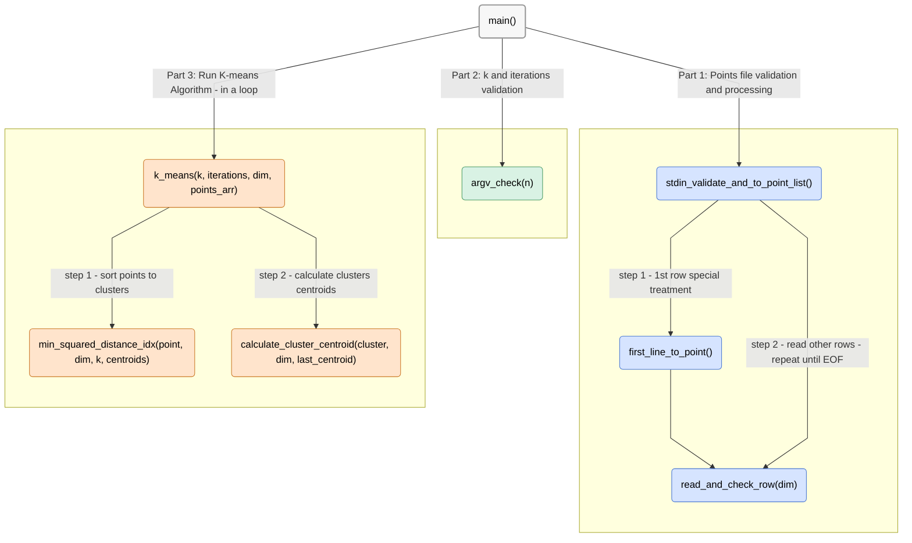

# K-means - python implementation

## This program implements the K-means clustering algorithm and outputs the final centroids of the computed clusters.

***Note:** Before reading this guide, read the main repository `RADME.md` file.*

## Program Structure
**The program begins execution in the main() function and is organized into three main stages:** 

**1. Points file validation and processing: Validate the points file. if valid, creates point list.**  
Since the points are provided through stdin, each row can only be read once. To handle this, the first row is processed separately—this initializes the list and determines the expected point dimension. The remaining rows are then read sequentially, ensuring each matches the expected dimension, and appended to the points list.

**2. `k` and `iterations` validation: Validate the `k` and `iterations` input and store them if valid.**  
*Note: The points list must be built before this step, as the number of points is required to validate k.*

**3. Run K-means Algorithm: Runs the K-means algorithm on the inputs and prints the final centroids list.**  
The algorithm runs for the specified number of iterations or stops earlier if the centroids remain unchanged between iterations.  
Once completed, the final centroids are rounded to four decimal places for alignment and then printed.

## Functions Graphic view


## Functions API

| <div align="center">Function Name</div> | Description | Args | Returns | Raises |
|---|---|---|---|---|
| <div align="center" style="background-color:#d6e4ff;">stdin_validate_and_to_point_list</div> | Validate stdin input and return (dimension, points). | <div align="center">–</div> | tuple[int, tuple[tuple[float]]]: Dimension of the points and a tuple of all points. | ValueError: If inputs are invalid. |
| <div align="center" style="background-color:#d6e4ff;">first_line_to_point</div> | Read the first row from stdin, validate it, determine its dimension, and return both the dimension and the point. | <div align="center">–</div> | tuple[int, tuple[float]] \| None: Dimension of the point and the point as a tuple of floats or None if line empty. | <div align="center">–</div> |
| <div align="center" style="background-color:#d6e4ff;">read_and_check_row</div> | Read a row from stdin, validate its length against the expected dimension, and return it as a tuple of floats. | dim (int \| None): Expected dimension of the point, or None to skip length check. | tuple[float] \| None: Point as a tuple of floats or None if row empty. | ValueError: If inputs are invalid. |
| <div align="center" style="background-color:#d9f2e4;">argv_check</div> | Check CMD args are valid (as expected in Table 1), excluding stdin dataflow. | n (int): Number of points | tuple[int, int]: (k, iterations) | ValueError: If inputs are invalid. |
| <div align="center" style="background-color:#ffe4cc;">k_means</div> | Run the K-means algorithm. | k (int): Number of clusters (1 < k < n).<br>iterations (int): Maximum iterations (default 400 if not provided by caller).<br>dim (int): Point dimensionality.<br>points_arr (list[tuple[float, ...], ...]): Points as a list of length-n tuples, each of length `dim`. | list[list[float]]: The k centroids (each length `dim`), rounded to 4 decimals. | ValueError: If inputs are invalid. |
| <div align="center" style="background-color:#ffe4cc;">min_squared_distance_idx</div> | Return the index of the nearest centroid by squared Euclidean distance. | point (tuple[float]): Coordinates of the point.<br>dim (int): Dimensionality of the points.<br>k (int): Number of centroids.<br>centroids (list[list[float]]): List of centroids. | int: Index (0-based) of the centroid closest to 'point'. | <div align="center">–</div> |
| <div align="center" style="background-color:#ffe4cc;">calculate_cluster_centroid</div> | Calculate the centroid of a cluster.<br><br>If the cluster is empty, returns a copy of 'last_centroid'. | cluster (list[list[float]]): Points in the cluster.<br>dim (int): Dimensionality of the points.<br>last_centroid: Previous centroid to keep if 'cluster' is empty. | list[float]: The centroid coordinates. | <div align="center">–</div> |
| <div align="center" style="background-color:#f7f7f7;">round_coordinates</div> | Round each coordinate in each centroid to 4 decimal places. | <div align="center">–</div> | <div align="center">–</div> | <div align="center">–</div> |

## Usage

**1. Example command to run the program:**
```bash
python3 kmeans.py k [iterations] < points.txt
```
